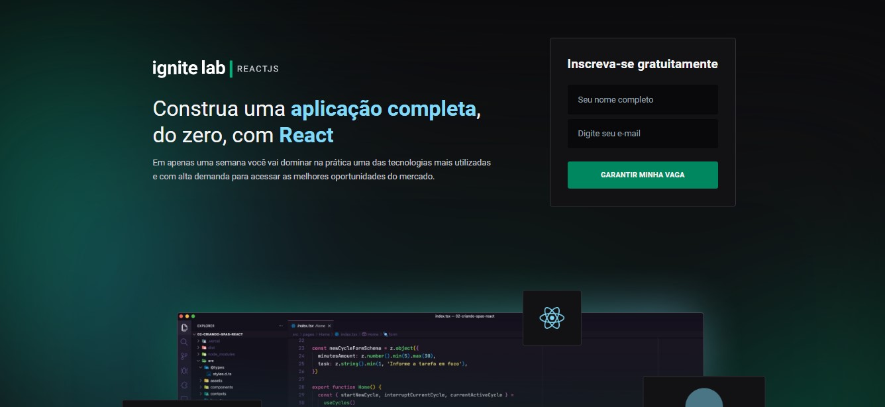

<h1 align="center"> Plataforma de Evento da RocketSeat </h1>

  <a href="#-tecnologias">Tecnologias</a>&nbsp;&nbsp;&nbsp;|&nbsp;&nbsp;&nbsp;
  <a href="#-layout">Layout</a>&nbsp;&nbsp;&nbsp;|&nbsp;&nbsp;&nbsp;
  <a href="#memo-licença">Licença</a>

  

 

  
  

## 🚀 Tecnologias

Esse projeto foi desenvolvido com as seguintes tecnologias:

- React
- Typescript
- TailwindCSS
- Phosphor-react
- Date-fns
- VimeReact
- React-router-dom v6
- GraphQL
- Graphql-codegen "Para criação de schemas"

- Back-end = <a href="https://app.hygraph.com/" alt="back-end">Hygraph</a>

## Caso desejar fazer uma cópia do projeto:

- Fazer uma copía do schema do Ignite-lab nesse link :  <a href="https://rseat.in/lab-graphcms">Hygraph</a>
- Crie váriaveis de ambiente: {
  VITE_API_URL="SUA URL API"
  VITE_API_ACCESS_TOKEN="SEU TOKEN"
}

- Para pegar URL DA API: Setting Project > API ACCESS > CONTENT API
- VITE_API_ACCESS_TOKEN = Você precisa criar nessa caminho acima um BearerToken

## 🔖 Layout

Você pode visualizar o layout do projeto através [DESSE LINK](https://www.figma.com/community/file/1120711251998877938). É necessário ter conta no [Figma](https://figma.com) para acessá-lo.

## :memo: Licença

Esse projeto está sob a licença MIT.

---
